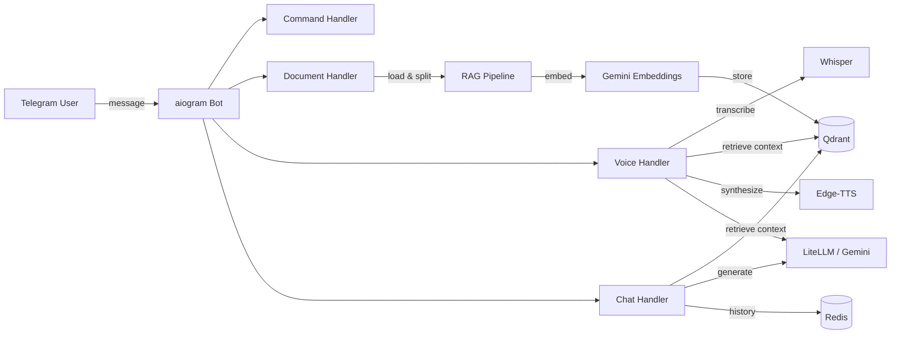

# 🤖 SmartFlow AI


A deployable **AI-powered Telegram assistant** with conversational memory, document Q&A (RAG), voice messages, and multi-model LLM support.

Try the demo bot: [@test_helper_fh_bot](https://t.me/test_helper_fh_bot)

---

## ✨ Features

| Feature | Description |
|---------|-------------|
| 💬 **Smart Chat** | Context-aware conversations powered by Gemini / OpenAI / Groq via LiteLLM |
| 📄 **Document Q&A** | Upload PDF / DOCX / TXT → auto-indexed in Qdrant → ask questions about content |
| 🔐 **Scoped RAG Isolation** | Retrieval is scoped by `user_id + chat_id`, with `source_id` metadata stored per uploaded document |
| 🎙 **Voice Mode** | Send a voice message → STT → optional RAG over indexed docs → LLM → TTS (Edge-TTS) |
| 🧠 **Memory** | Redis-backed conversation history with configurable TTL and max exchanges |
| 🧱 **Document Limits** | File size, MIME type, chunk count, and per-chat document caps protect the bot from abuse |
| 🩺 **Health Checks** | Startup dependency checks plus `/health` endpoint for webhook deployments |
| ✅ **CI** | GitHub Actions runs unit tests on every push and pull request |
| ⚡ **Dual Mode** | Long-polling for development, FastAPI webhooks for production |
| 🐳 **Docker** | One-command deployment with `docker compose up` |

---

## 🏗 Architecture



---

## 📁 Project Structure

```
smartflow-ai-bot/
├── bootstrap.py         # Shared startup, logging, and bot command setup
├── main.py              # Polling entrypoint
├── app.py               # Webhook entrypoint (FastAPI)
├── config.py            # Pydantic-settings configuration
├── handlers/
│   ├── commands.py      # /start, /help, /clear, /clear_docs, /status
│   ├── chat.py          # Text message handler with RAG
│   ├── voice.py         # Voice message pipeline (STT → RAG → LLM → TTS)
│   └── document.py      # File upload and indexing
├── utils/
│   ├── llm.py           # LiteLLM integration
│   └── audio.py         # Whisper STT + Edge-TTS
├── rag/
│   ├── embedder.py      # Gemini embedding model
│   ├── loader.py        # Document loading & chunking
│   ├── chain.py         # Context retrieval
│   ├── scoping.py       # User-level metadata & Qdrant filters
│   └── vectorstore.py   # Qdrant vector store
├── memory/
│   └── conversation.py  # Redis conversation memory
├── services/
│   ├── conversation.py  # Shared RAG-aware message preparation
│   ├── documents.py     # Upload validation and document limits
│   └── health.py        # Redis/Qdrant dependency checks
├── tests/
│   ├── test_conversation.py # Unit tests for shared conversation pipeline
│   ├── test_config.py   # Unit tests for config validation
│   ├── test_documents.py # Unit tests for document validation policy
│   └── test_scoping.py  # Unit tests for user-scoped RAG helpers
├── Dockerfile
├── docker-compose.yml
├── requirements.txt
├── .env.example
└── LICENSE
```

---

## 🚀 Quick Start

### Prerequisites

- Python 3.11+
- Docker (for Redis & Qdrant)
- `ffmpeg` (for voice processing)
- Gemini API key ([get one free](https://aistudio.google.com/))

### 1. Clone & Install

```bash
git clone https://github.com/makquella/telegram-bot-ai-support.git
cd telegram-bot-ai-support
python -m venv venv
source venv/bin/activate
pip install -r requirements.txt
```

### 2. Configure

```bash
cp .env.example .env
# Edit .env — set BOT_TOKEN and GEMINI_API_KEY at minimum
```

### 3. Start Services

```bash
# Redis + Qdrant
docker run -d --name redis -p 6379:6379 redis:7-alpine
docker run -d --name qdrant -p 6333:6333 qdrant/qdrant:latest
```

### 4. Run In Polling Mode

```bash
export USE_WEBHOOK=false
python main.py
```

### 5. Run In Webhook Mode

```bash
export USE_WEBHOOK=true
export WEBHOOK_URL=https://your-domain.com
uvicorn app:app --host 0.0.0.0 --port 8000
```

---

## 🐳 Docker Deployment

Infrastructure only:

```bash
cp .env.example .env
# Edit .env with your tokens
docker compose up -d redis qdrant
```

Polling mode:

```bash
docker compose --profile polling up -d
```

Webhook mode:

```bash
docker compose --profile webhook up -d
```

For webhook mode, make sure `USE_WEBHOOK=true` and `WEBHOOK_URL` are set in `.env`.

---

## ✅ Testing

Run unit tests locally:

```bash
python -m unittest discover -s tests -v
```

GitHub Actions runs the same test suite automatically on every push and pull request.

---

## ⚙️ Configuration

All settings via environment variables or `.env` file:

| Variable | Default | Description |
|----------|---------|-------------|
| `BOT_TOKEN` | — | Telegram bot token (required) |
| `GEMINI_API_KEY` | — | Google Gemini API key |
| `LLM_MODEL` | `gemini/gemini-3-flash-preview` | LiteLLM model ID |
| `EMBEDDING_MODEL` | `models/gemini-embedding-2-preview` | Embedding model |
| `WHISPER_MODEL` | `medium` | Whisper size: tiny/small/medium/large |
| `TTS_VOICE` | `ru-RU-SvetlanaNeural` | Edge-TTS voice |
| `VOICE_USE_RAG` | `true` | Whether transcribed voice messages should use document retrieval |
| `MAX_DOCUMENT_SIZE_MB` | `20` | Maximum uploaded document size |
| `MAX_CHUNKS_PER_DOCUMENT` | `100` | Maximum chunks created from a single document |
| `MAX_DOCUMENTS_PER_CHAT` | `20` | Maximum indexed documents per user in one chat |
| `MAX_HISTORY` | `15` | Conversation exchanges to remember |
| `MEMORY_TTL` | `86400` | Memory auto-expiry (seconds) |
| `DATA_DIR` | `data` | Directory for temp audio/doc processing |

See [.env.example](.env.example) for the full list.

---

## 🛠 Tech Stack

- **Bot Framework**: [aiogram 3.x](https://docs.aiogram.dev/)
- **LLM**: [LiteLLM](https://github.com/BerriAI/litellm) (Gemini, OpenAI, Groq)
- **Embeddings**: [Google Gemini Embedding](https://ai.google.dev/gemini-api/docs/embeddings)
- **Vector Store**: [Qdrant](https://qdrant.tech/)
- **Memory**: [Redis](https://redis.io/)
- **STT**: [faster-whisper](https://github.com/SYSTRAN/faster-whisper)
- **TTS**: [edge-tts](https://github.com/rany2/edge-tts)
- **Webhook**: [FastAPI](https://fastapi.tiangolo.com/) + [uvicorn](https://www.uvicorn.org/)
- **Config**: [pydantic-settings](https://docs.pydantic.dev/latest/concepts/pydantic_settings/)

---

## 📝 License

[MIT](LICENSE)
