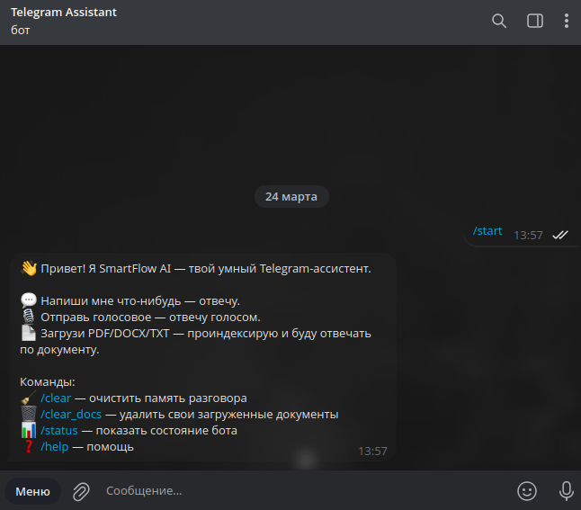
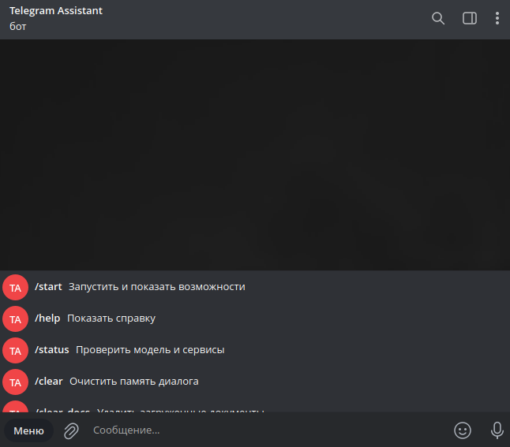
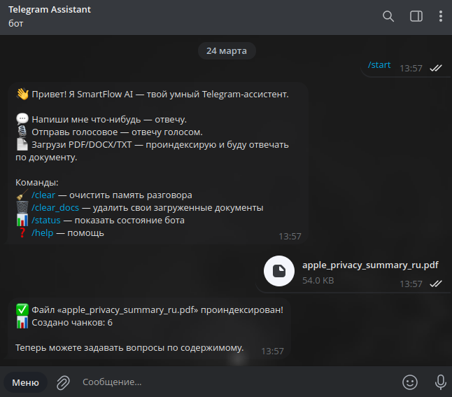
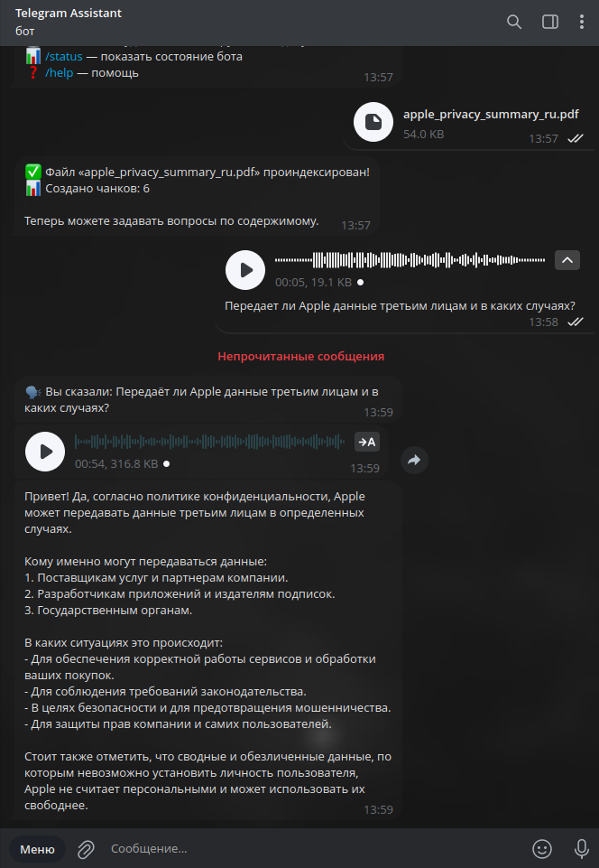
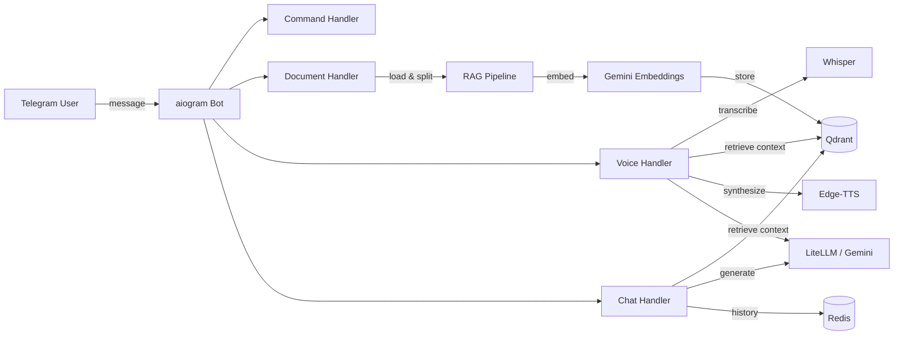

# 🤖 SmartFlow AI


[](https://github.com/makquella/telegram-bot-ai-support/actions/workflows/ci.yml)

A deployable **AI-powered Telegram assistant** for chat, document Q&A, and voice workflows.

It combines LiteLLM, Redis memory, and Qdrant-backed RAG in one Telegram interface, with both local polling and production-style webhook modes.

Try the demo bot: [@test_helper_fh_bot](https://t.me/test_helper_fh_bot)

Project docs: [Case Study](CASE_STUDY.md) · [Privacy](PRIVACY.md)

---

## ✨ Features

- **Chat + memory**: context-aware conversations with Redis-backed short-term history.
- **Document Q&A**: upload `PDF`, `DOCX`, or `TXT`, index in Qdrant, and ask questions over the content.
- **Voice workflow**: send a voice note, transcribe it with Whisper, optionally use RAG, and return text plus optional TTS.
- **Scoped retrieval**: document search is isolated by `user_id + chat_id`.
- **Operational basics**: Docker, health checks, CI, pinned dependencies, and both polling and webhook modes.

---

## 📸 Bot In Action

<table width="100%">
  <tr>
    <td align="center" valign="top" width="50%">
      <br>
      <sub><b>Welcome screen and command overview</b></sub>
    </td>
    <td align="center" valign="top" width="50%">
      <br>
      <sub><b>Built-in Telegram command menu</b></sub>
    </td>
  </tr>
  <tr>
    <td align="center" valign="top" width="50%">
      <br>
      <sub><b>Document upload and indexing</b></sub>
    </td>
    <td align="center" valign="top" width="50%">
      <br>
      <sub><b>Voice question answered from indexed content</b></sub>
    </td>
  </tr>
</table>

---

## 🏗 Architecture



---

## 📁 Project Structure

```
smartflow-ai-bot/
├── bootstrap.py         # Shared startup, logging, and bot command setup
├── main.py              # Polling entrypoint
├── app.py               # Webhook entrypoint (FastAPI)
├── config.py            # Pydantic-settings configuration
├── .python-version      # Recommended Python version for local setup
├── pyproject.toml       # Ruff lint/format configuration
├── .pre-commit-config.yaml # Optional local quality hooks
├── handlers/
│   ├── commands.py      # /start, /help, /clear, /clear_docs, /status
│   ├── chat.py          # Text message handler with RAG
│   ├── voice.py         # Voice message pipeline (STT → RAG → LLM → TTS)
│   └── document.py      # File upload and indexing
├── utils/
│   ├── llm.py           # LiteLLM integration
│   └── audio.py         # Whisper STT + Edge-TTS
├── rag/
│   ├── embedder.py      # Gemini embedding model
│   ├── loader.py        # Document loading & chunking
│   ├── chain.py         # Context retrieval
│   ├── scoping.py       # User-level metadata & Qdrant filters
│   └── vectorstore.py   # Qdrant vector store
├── memory/
│   └── conversation.py  # Redis conversation memory
├── services/
│   ├── conversation.py  # Shared RAG-aware message preparation
│   ├── documents.py     # Upload validation and document limits
│   └── health.py        # Redis/Qdrant dependency checks
├── tests/
│   ├── test_conversation.py # Unit tests for shared conversation pipeline
│   ├── test_config.py   # Unit tests for config validation
│   ├── test_documents.py # Unit tests for document validation policy
│   └── test_scoping.py  # Unit tests for user-scoped RAG helpers
├── Dockerfile
├── docker-compose.yml
├── requirements.txt     # Editable top-level dependency spec
├── requirements.lock    # Fully pinned tested dependency set
├── requirements-dev.txt # Pinned dev tools for linting/pre-commit
├── .env.example
└── LICENSE
```

---

## 🚀 Quick Start

### Prerequisites

- Python 3.12.3
- Docker (for Redis & Qdrant)
- `ffmpeg` (for voice processing)
- Gemini API key ([get one free](https://aistudio.google.com/))

### 1. Clone & Install

```bash
git clone https://github.com/makquella/telegram-bot-ai-support.git
cd telegram-bot-ai-support
python3.12 -m venv venv
source venv/bin/activate
pip install -r requirements.lock
```

`requirements.lock` is the reproducible, fully pinned install set used by Docker and CI. `requirements.txt` remains in the repo as the editable top-level dependency spec for refreshing the lock file.

Optional developer tooling:

```bash
pip install -r requirements-dev.txt
pre-commit install
```

### 2. Configure

```bash
cp .env.example .env
# Edit .env — set BOT_TOKEN and GEMINI_API_KEY at minimum
```

### 3. Start Services

```bash
# Redis + Qdrant
docker run -d --name redis -p 6379:6379 redis:7-alpine
docker run -d --name qdrant -p 6333:6333 qdrant/qdrant:latest
```

### 4. Run In Polling Mode

```bash
export USE_WEBHOOK=false
python main.py
```

### 5. Run In Webhook Mode

```bash
export USE_WEBHOOK=true
export WEBHOOK_URL=https://your-domain.com
uvicorn app:app --host 0.0.0.0 --port 8000
```

---

## 🐳 Docker Deployment

Infrastructure only:

```bash
cp .env.example .env
# Edit .env with your tokens
docker compose up -d redis qdrant
```

Polling mode:

```bash
docker compose --profile polling up -d
```

Webhook mode:

```bash
docker compose --profile webhook up -d
```

For webhook mode, make sure `USE_WEBHOOK=true` and `WEBHOOK_URL` are set in `.env`.

---

## 📦 Reproducible Environment

The project is currently locked and tested against Python `3.12.3`.

- `.python-version` pins the recommended interpreter version for local development.
- `requirements.lock` pins the exact Python package set used by the project.
- Docker installs from `requirements.lock`.
- CI installs from `requirements.lock`.

This gives contributors and clients a single, predictable environment instead of a floating `>=` dependency set.

---

## 🧹 Code Quality

The project uses `ruff` for both linting and formatting, and ships with an optional `pre-commit` setup so checks can run automatically before each commit.

Manual commands:

```bash
ruff check .
ruff format --check .
pre-commit run --all-files
```

Local automation:

```bash
pip install -r requirements-dev.txt
pre-commit install
```

GitHub Actions runs the same baseline quality checks in CI before the test job, and the README badge reflects the workflow status.

---

## 🚦 Production / Deployment Notes

### Polling vs Webhook

Use polling for local development, quick debugging, and environments where exposing a public HTTPS endpoint is unnecessary. In this mode the bot runs with `python main.py` and continuously pulls updates from Telegram.

Use webhook mode for production-style deployments. In this mode the bot runs behind FastAPI via `uvicorn app:app`, Telegram pushes updates to the configured webhook URL, and the app exposes a `/health` endpoint for readiness checks. Webhook mode requires `USE_WEBHOOK=true` and a valid public `WEBHOOK_URL`.

### Configuration via Environment

Runtime configuration is managed through environment variables or `.env`, not hardcoded values.

Typical required settings:

- Telegram: `BOT_TOKEN`
- LLM provider: `LLM_MODEL` plus the matching provider key such as `GEMINI_API_KEY`, `OPENAI_API_KEY`, or `GROQ_API_KEY`
- Infrastructure: `REDIS_URL`, `QDRANT_URL`
- Mode selection: `USE_WEBHOOK`, `WEBHOOK_URL`, `WEBHOOK_PATH`, `PORT`
- Limits and behavior: `MAX_HISTORY`, `MEMORY_TTL`, `MAX_DOCUMENT_SIZE_MB`, `MAX_CHUNKS_PER_DOCUMENT`, `MAX_DOCUMENTS_PER_CHAT`, `VOICE_USE_RAG`, `DATA_DIR`

The application validates key runtime combinations on startup. For example, webhook mode requires `WEBHOOK_URL`, and Gemini-backed models require a Gemini API key.

### Reverse Proxy and HTTPS

For webhook deployments, the bot is typically placed behind a reverse proxy such as Nginx, Caddy, Traefik, or a cloud load balancer. In production, Telegram should reach the app through a public HTTPS endpoint, while the Python service itself can stay on an internal port like `8000`.

This repository exposes the webhook app directly, but in a real deployment the usual setup is:

- reverse proxy handles TLS/HTTPS;
- proxy forwards requests to `uvicorn app:app`;
- health checks hit `/health`;
- Redis and Qdrant stay on private/internal network addresses when possible.

### Failure Handling Expectations

The project is designed to fail in a controlled way instead of crashing the entire bot on routine dependency issues.

- If the LLM provider fails, the bot returns a fallback error message instead of breaking the request flow.
- If Redis is unavailable, memory operations log errors and the bot can still answer requests, but without reliable conversation history.
- If Qdrant or retrieval fails, the bot can still answer general questions, but document-aware context may be missing.
- In webhook mode, `/health` reports dependency degradation with a non-`200` status when Redis or Qdrant is unreachable.
- If an uploaded file is invalid or exceeds configured limits, it is rejected before indexing.
- If voice processing or document parsing fails, the user receives explicit feedback and temporary files are cleaned up in the normal flow. Storage-layer failures are logged and should be treated as operational alerts.

For production use, operators should monitor logs and treat Redis/Qdrant health degradation as an operational alert, even when the bot can still partially serve traffic.

### Rate Limits and Cost Control

AI bots need explicit cost boundaries. In the current implementation, the main built-in controls are:

- bounded conversation history via `MAX_HISTORY` and `MEMORY_TTL`;
- document upload validation by type, MIME type, and size;
- chunk-count limits via `MAX_CHUNKS_PER_DOCUMENT`;
- per-chat document caps via `MAX_DOCUMENTS_PER_CHAT`;
- optional control over whether voice requests use RAG via `VOICE_USE_RAG`.

These controls help reduce accidental cost growth, oversized indexing jobs, and abuse through very large uploads.

For internet-facing production deployments, it is also recommended to add infrastructure-level protections such as:

- per-user or per-chat request throttling;
- alerting on abnormal token or embedding usage;
- provider-level budget caps where available;
- reverse-proxy or gateway rate limiting for burst control.

The current repository covers basic cost and storage boundaries inside the app. External rate limiting is an operational hardening layer that should be added when exposing the bot to broader traffic.

---

## ✅ Testing

Run unit tests locally:

```bash
python -m unittest discover -s tests -v
```

GitHub Actions runs the same test suite automatically on every push and pull request.

---

## ⚙️ Configuration

All settings via environment variables or `.env` file:

| Variable | Default | Description |
|----------|---------|-------------|
| `BOT_TOKEN` | — | Telegram bot token (required) |
| `GEMINI_API_KEY` | — | Google Gemini API key |
| `LLM_MODEL` | `gemini/gemini-3-flash-preview` | LiteLLM model ID |
| `EMBEDDING_MODEL` | `models/gemini-embedding-2-preview` | Embedding model |
| `WHISPER_MODEL` | `medium` | Whisper size: tiny/small/medium/large |
| `TTS_VOICE` | `ru-RU-SvetlanaNeural` | Edge-TTS voice |
| `VOICE_USE_RAG` | `true` | Whether transcribed voice messages should use document retrieval |
| `MAX_DOCUMENT_SIZE_MB` | `20` | Maximum uploaded document size |
| `MAX_CHUNKS_PER_DOCUMENT` | `100` | Maximum chunks created from a single document |
| `MAX_DOCUMENTS_PER_CHAT` | `20` | Maximum indexed documents per user in one chat |
| `MAX_HISTORY` | `15` | Conversation exchanges to remember |
| `MEMORY_TTL` | `86400` | Memory auto-expiry (seconds) |
| `DATA_DIR` | `data` | Directory for temp audio/doc processing |

See [.env.example](.env.example) for the full list.

---

## 🔐 Data Handling

SmartFlow AI accepts text messages, voice messages, and uploaded documents. Conversation history is stored temporarily in Redis with a configurable TTL and bounded history, while indexed document chunks, embeddings, and scope metadata are stored in Qdrant for RAG.

The bot also uses a local `DATA_DIR` for temporary document and audio processing, and removes those files after processing in the normal flow. Users can control their data directly with `/clear` for chat memory and `/clear_docs` for indexed documents and related vector data. The default setup is not meant to be a secure vault for sensitive data without extra hardening, and users remain responsible for the legality and rights status of uploaded content.

For the full data-handling and privacy overview, including storage details, deletion behavior, sensitive-data guidance, and content responsibility, see [PRIVACY.md](PRIVACY.md).

---

## 🛠 Tech Stack

- **Bot Framework**: [aiogram 3.x](https://docs.aiogram.dev/)
- **LLM**: [LiteLLM](https://github.com/BerriAI/litellm) (Gemini, OpenAI, Groq)
- **Embeddings**: [Google Gemini Embedding](https://ai.google.dev/gemini-api/docs/embeddings)
- **Vector Store**: [Qdrant](https://qdrant.tech/)
- **Memory**: [Redis](https://redis.io/)
- **STT**: [faster-whisper](https://github.com/SYSTRAN/faster-whisper)
- **TTS**: [edge-tts](https://github.com/rany2/edge-tts)
- **Webhook**: [FastAPI](https://fastapi.tiangolo.com/) + [uvicorn](https://www.uvicorn.org/)
- **Config**: [pydantic-settings](https://docs.pydantic.dev/latest/concepts/pydantic_settings/)

---

## 📝 License

[MIT](LICENSE)
